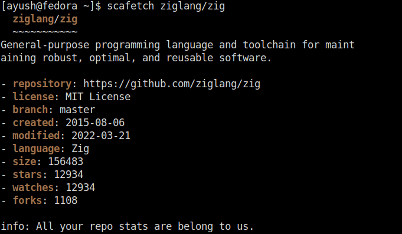

# scafetch
[](https://github.com/iddev5/scafetch/actions)
[](LICENSE.md)
[](https://ziglang.org)

Scafetch is a command-line tool to display information about your remote Git repositories in an aesthetic and visually pleasing way.

It currently supports fetching repository information from Github, Gitlab and Codeberg (Gitea).



# Installation
## Releases
You can get the latest stable [release](https://github.com/iddev5/scafetch/releases) from Github.

## Arch Linux (AUR)
Install the community maintained [scafetch](https://aur.archlinux.org/packages/scafetch) package.

# Usage
You only need Zig master and Gyro master to compile. All other dependencies are fetched by Gyro.

Use gyro to build:
```
gyro build -Drelease-safe
```
(You can optionally install it in a system or user wide directory for easier access, use the ``-p <prefix>`` flag for convenience)

Then, run the application:
```
./zig-out/bin/scafetch ziglang/zig
```
where ``ziglang/zig`` is taken as an example repository address, and the host defaults to Github

It is also possible to explicitly state the host service name

Host name | 1                      | 2                            | 3
----------|------------------------|------------------------------|---------------------------------
Github    | ``gh/<author>/<repo>`` | ``github/<author>/<repo>``   | ``github.com/<author>/<repo>``
Gitlab    | ``gl/<author>/<repo>`` | ``gitlab/<author>/<repo>``   | ``gitlab.com/<author>/<repo>``
Codeberg  | ``cb/<author>/<repo>`` | ``codeberg/<author>/<repo>`` | ``codeberg.org/<author>/<repo>``

# Todo
- More CLI flags, like opt out of coloring, what info to display etc.
- Authentication support
- Show an ASCII art of the primary language(?) of the repository

# License
scafetch is licensed under [MIT License](LICENSE)
